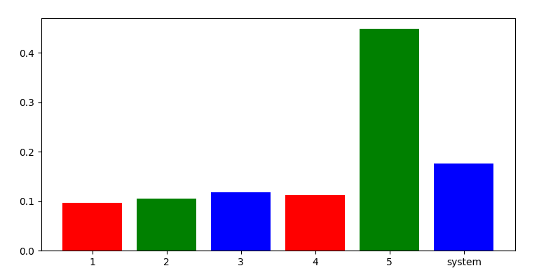

# Indoor_Positioning_Algorithm
Introduce some classic indoor positioning algorithms and code implementations 
landmarc.py 为 landmarc 算法的 python 实现。

运行结果如下：

result of predict [[2.34335539 4.31106933]
 [4.66056494 4.67537382]
 [5.30972862 2.65652928]
 [6.66997345 7.33489215]
 [8.33493883 8.33058597]]
mse: [0.09676413061163142, 0.10538215388148721, 0.1179721388002703, 0.11215275412587787, 0.4481151447145073] 0.1760772644267548

效果图如下（每次运行结果不同）：

k = 3 时的定位效果图

定位均方根误差（1-5 为 5 个待测标签的 rmse，system 为系统误差，即前五个的均值）：

